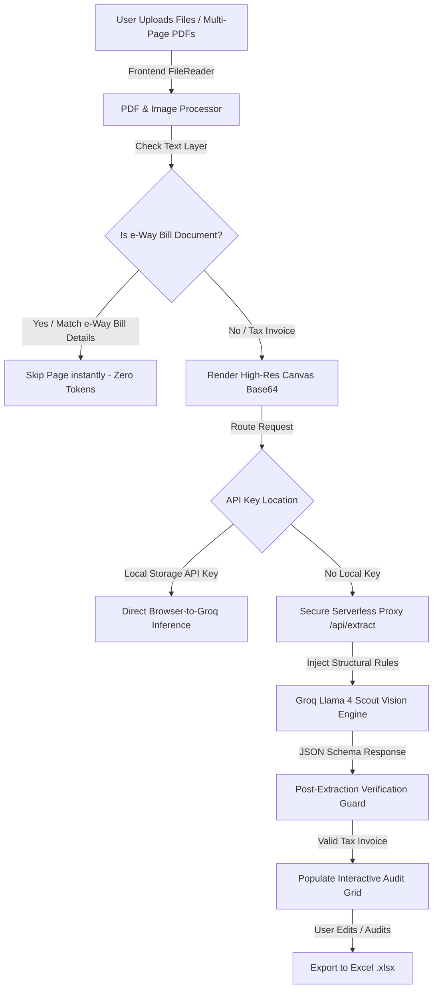

# ✦ Auditflow: Professional Invoice Intelligence & Data Extraction Platform

**Auditflow** is a state-of-the-art, AI-driven document extraction and auditing platform engineered to transform unstructured financial invoices, multi-page PDFs, and scanned receipts into clean, audit-ready data. Built with a **Privacy-First Hybrid Architecture**, Auditflow leverages multimodal LLMs (`Llama 4 Scout` via Groq) combined with zero-token local heuristics to automate complex data entry with near-instantaneous speed and precision.


-F472B6)


---

## 🚀 The Mission
Auditors and accounting professionals spend countless hours transcribing data from messy digital scans, multi-page PDFs, and mixed document bundles. Auditflow eliminates this bottleneck through an intelligent pipeline that extracts accurate financial metadata while saving API tokens, enforcing strict accounting rules, and filtering out extraneous transport documents automatically.

---

## ✦ Key Innovations & Architectural Highlights

### 1. Three-Layer Document Classification & e-Way Bill Exclusion
Auditflow introduces a multi-tier defense system that prevents non-invoice pages (such as e-Way Bill delivery/transport slips) from polluting your audit tables or wasting API tokens:

* **Layer 1 — Instant Zero-Token Pre-Screening (`pdf.js` Text Layer):**  
  Before rendering multi-page PDF documents or making API calls, Auditflow inspects the document's local text layer (`page.getTextContent()`). If a page is identified as an e-Way Bill document (`1. e-Way Bill Details` or primary `e-Way Bill` headers without Tax Invoice markers), the page is skipped instantly at **$0 cost and 0 token overhead**.
* **Layer 2 — Text-Based Few-Shot Prompt Rules (`CRITICAL STEP 1`):**  
  For scanned images where text layers aren't present, our specialized prompt guides `Llama 4 Scout` to classify document types before extraction. It explicitly distinguishes between **e-Way Bill documents** (which return exactly `{"ignore": true, "document_type": "e-Way Bill"}`) and **Tax Invoices that contain an `e-Way Bill No.` box** alongside `Invoice No.` (which are fully extracted!).
* **Layer 3 — Post-Extraction Safety Guard:**  
  The frontend and backend run verification checks over the returned JSON schema (`extracted.document_type === "e-Way Bill"` or `extracted.ignore === true`) before adding rows to the grid, guaranteeing a pristine audit trail.

### 2. Precision Accounting Extraction Rules
Instead of sending expensive image examples on every request, Auditflow encodes structural domain knowledge into structured system instructions:
* **Buyer GSTIN Priority (`gst_no`):** Specifically targets the GSTIN listed under `Buyer (Bill to)` / `Consignee (Ship to)` while ignoring seller letterheads.
* **Subtotal Amount Aggregation (`amount`):** Automatically detects and extracts the Total Taxable Value (sum of individual line item charges before tax) rather than picking isolated line items.
* **Combined Effective Tax Rate (`rate`):** Sums dual tax percentages automatically (`Output CGST @9% + SGST @9%` $\rightarrow$ `18`), reflecting the true combined GST percentage.

### 3. High-Density UI & Seamless Multi-File Workflow
* **Continuous Appending:** Upload multiple batches or single invoices seamlessly. New uploads automatically append to the active data grid without blocking confirmation prompts.
* **Consistent Branding & Micro-animations:** Features a clean top navigation bar with synced `.btn-download` action buttons, glassmorphism, and subtle entry animations for each extracted row.
* **On-the-Fly Spreadsheet Generation:** Edit cells directly in the interactive data grid and export instantly to `.xlsx` using `SheetJS`.

---

## 🛠️ System Architecture & Data Flow



---

## 💻 Tech Stack & Dependencies

* **Frontend:** Vanilla JavaScript (ES6+), HTML5, CSS3 (Custom Design System with CSS Tokens)
* **Backend Proxy:** Node.js (`server.js` for local dev), Vercel Serverless Functions (`api/extract.js`)
* **AI Engine:** Groq Inference Engine running `meta-llama/llama-4-scout-17b-16e-instruct`
* **Core Libraries:**
  * [`pdfjs-dist`](https://mozilla.github.io/pdf.js/) — In-browser PDF rendering and text layer parsing
  * [`SheetJS (xlsx)`](https://sheetjs.com/) — Client-side Excel `.xlsx` spreadsheet generation

---

## 🚀 Getting Started & Deployment

### Option A: Local Development (Proxy Mode)
1. **Clone the repository:**
   ```bash
   git clone https://github.com/PranavHariharan19/Auditflow.git
   cd Auditflow
   ```
2. **Configure your Environment:**
   Copy the example configuration file and enter your Groq API key:
   ```bash
   cp .env.example .env.local
   # Edit .env.local and add your Groq_API_Key=gsk_...
   ```
3. **Start the local server:**
   ```bash
   npm run dev
   ```
4. Open **`http://localhost:3000`** in your browser.

### Option B: Zero-Setup Client-Side Mode
You can open `index.html` directly in any web browser without running a Node server!
1. Click the **Settings (⚙️)** button in the top right corner of the dashboard.
2. Paste your **Groq API Key** (`gsk_...`).
3. Your key is stored locally inside browser `localStorage` and requests will run direct-to-API.

### Cloud Deployment (Vercel / Netlify / Render)
Auditflow is pre-configured with a `vercel.json` routing engine and `.gitignore` safety measures:
1. Push the clean repository to GitHub.
2. Import the repository into [Vercel](https://vercel.com).
3. Set the `Groq_API_Key` environment variable inside your Vercel Project Settings.
4. Deploy! The serverless proxy (`/api/extract`) automatically securely orchestrates all inference requests.

---

## 🛡️ Security & Privacy Note
* **No Document Storage:** Invoices and images are processed in memory and immediately discarded after extraction.
* **Secret Protection:** All `.env*` files, local `node_modules/`, and test spreadsheet exports (`*.xlsx`) are excluded from version control via `.gitignore`.
* **Rate Limit Handling:** The system includes automatic retry mechanisms with exponential backoff (`429 Rate Limit`) and clear daily budget alerts (`DAILY_LIMIT_REACHED`).

---

*Engineered for speed. Designed for precision. Built for modern financial auditing.*
